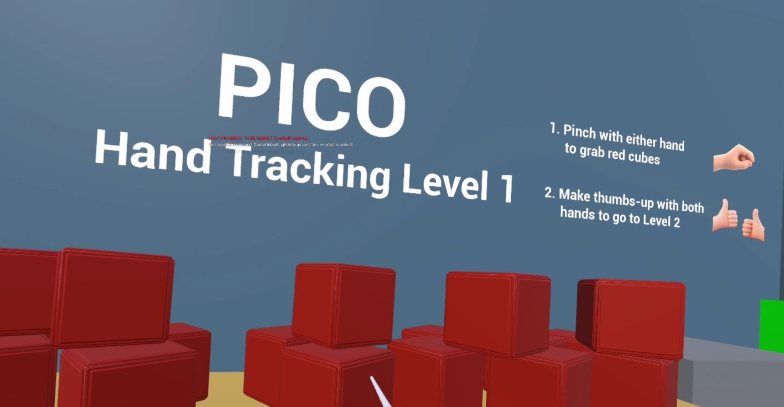
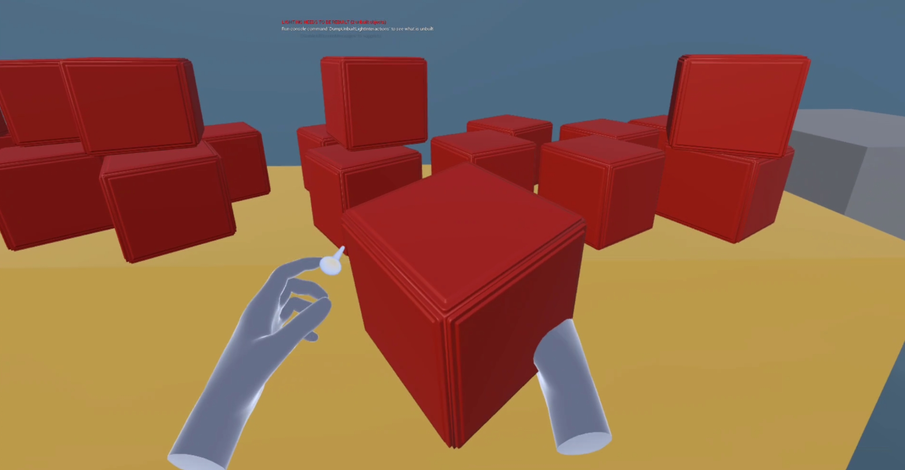
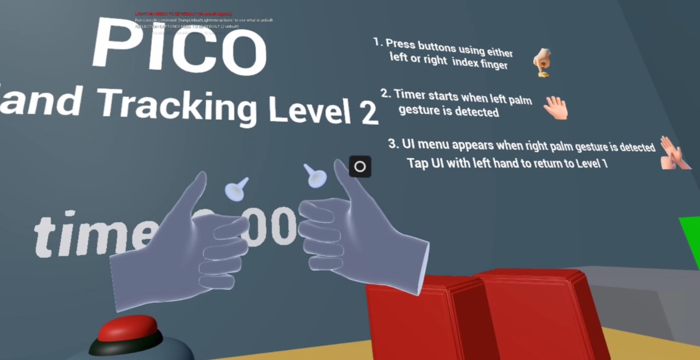
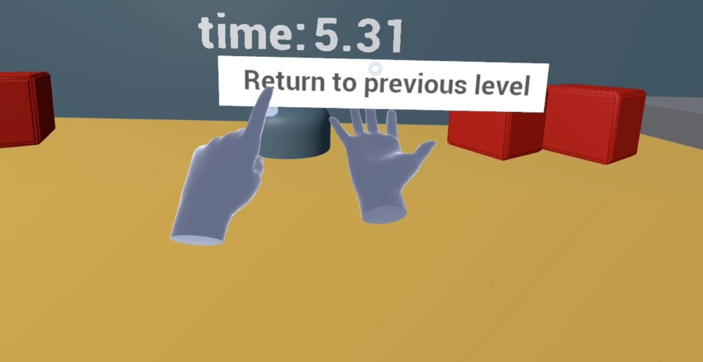

# PICO Unreal Hand Tracking Sample 

- If you have any questions/comments, please visit [**Pico Developer Support Portal**](https://picodevsupport.freshdesk.com/support/home) and raise your question there.

- This sample does not include the Pico Unreal Integration SDK 3.1.0 plugin; please download it from [**Pico Unreal Integration SDK 3.1.0 plugin**](https://developer.picoxr.com/zh/resources/).

## Unreal Engine 5 & SDK Version
- Unreal Engine : 5.3.2

- Pico Unreal Integration SDK v3.1.0

## Description:
  The sample implements functions as below:
* Pinch gesture recognition and object pinching
* Thumbs-up gesture recognition and level switch
* Palm detection timer
* Button poke interaction
* Clickable UI generation

|Sample Scene|Pinching Object|
|:-:|:-:|
|  |  |

|Left hand gesture detection|Poke Interaction|
|:-:|:-:|
|  |  

|Switch level hand gesture|UI Interaction|
|:-:|:-:|
|  |  |

## Note:
- This project integrates Pico Unreal Integration SDK 3.1.0 plugin for UE 5.3. If you are using other version Unreal engine, you will need to integrate the corresponding UE version plugin at [here.](https://developer.picoxr.com/zh/resources/#sdk)
